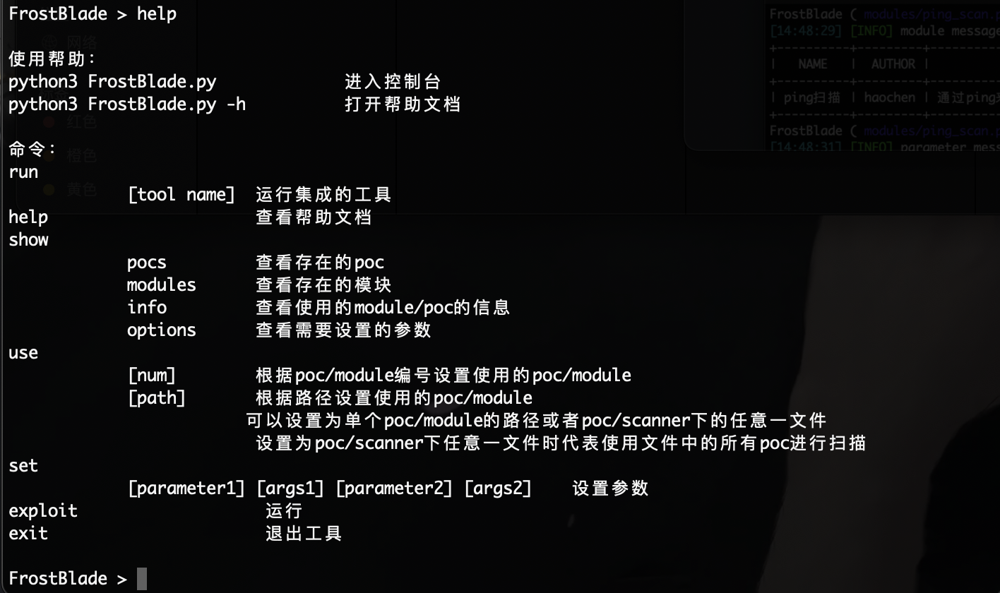

# FrostBlade

### 法律免责声明

未经双方事先同意，使用FrostBlade攻击目标是非法的。FrostBlade仅用于安全测试目的。

### 概述

FrostBlade是一款开源的web漏洞测试与验证框架，具有强大的通用性，渗透测试人员可根据接口编写poc，并使用该工具进行批量的漏洞验证工作，也可以根据接口编写自己的各种功能模块。

### 功能

通过编写的poc脚本进行批量的漏洞检测、漏洞攻击

通过编写的module脚本进行渗透测试

集成大量工具，可以轻松的在该工具内部控制台使用系统命令或者调用其他渗透测试工具（如brup等工具需要自定义启动路径与命令）

### 使用说明

Python3 frostblade.py 进入控制台

执行系统命令

运行工具

poc验证、攻击

module使用

help

