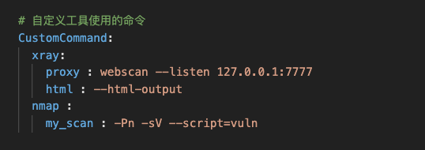

# FrostBlade

### 法律免责声明

未经双方事先同意，使用FrostBlade攻击目标是非法的。FrostBlade仅用于安全测试目的。

### 概述

FrostBlade是一款开源的用于快速启动各种渗透测试工具，并且具有web漏洞测试与验证框架，具有强大的通用性。渗透测试人员可以根据自己需要在配置文件中快速添加各种常用工具，方便在需要时快速启动，也可以根据接口编写poc，并使用该工具进行批量的漏洞验证工作，可以根据接口编写自己的各种功能模块。

### 功能

通过编写的poc脚本进行批量的漏洞检测、漏洞攻击

通过编写的module脚本进行渗透测试

集成大量工具，可以轻松的在该工具内部控制台使用系统命令或者快速启用、调用其他渗透测试工具（如brup等工具需要自定义启动路径与命令）

### 安装方法

```git
git clone https://github.com/haochen1204/FrostBlade.git
pip install -r requirements.txt
```

### 使用说明

Python3 frostblade.py 进入控制台

#### 执行系统命令

执行系统命令


#### 帮助文档


#### 运行工具

首先配置工具启动命令，如图


前台直接运行工具：


后台运行工具：


使用自定义命令运行工具

在配置文件中修改配置：

以xray为例，proxy为自定义命令，后面为自定义命令所对应的工具命令



使用方法：


#### 攻击载荷模块使用

```
show pocs 展示系统中的poc
use xxx(数字或者路径) 选择使用的poc
show info 查看使用poc的详细信息
show options 查看使用poc需要的参数信息
set xxx xxx 设置所需参数
exploit 开始攻击
```

在show options中，YES代表必需参数、NO代表非必需参数，target为目标参数，可以为文件或者单一目标

同样在使用use时，可以选择单个poc或者多个poc，直接输入路径则使用该路径下的所有poc。


#### 功能模块使用

```
show modules 查看系统中的功能模块
use xxx 选择使用的功能模块
show info 查看功能模块的详细信息
show options 查看功能模块所需参数
set xxx xxx 设置参数
exploit 运行该功能模块
```


### 接口说明

poc编写模版见pocs文件下\_\_init\_\_.py文件

需要设置的信息为\_\_init\_\_函数下的所有内容，在exploit中返回att_msg字典，该字典中需要包括target（目标）、pocname（poc名称）、status（攻击状态）以及msg（显示信息）4个参数。也可以直接调用output接口将结果直接显示在命令行中。

功能模块编写模版见modules文件下\_\_init\_\_.py文件